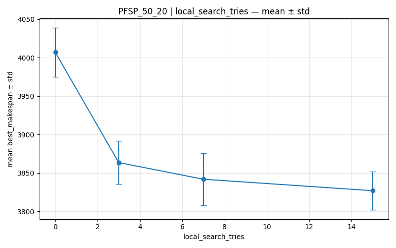
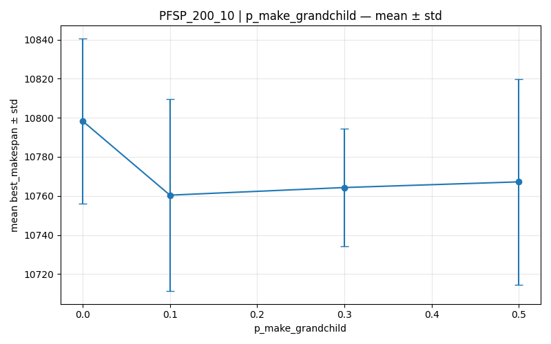

- pmx - kopiuje losowy fragment sekwencji z pierwszego rodzica do potomka, a następnie próbuje wypełnić puste miejsca elementami z drugiego rodzica. W przypadku gdy element z drugiego rodzica już istnieje w skopiowanym fragmencie, algorytm wykorzystuje pętlę mapującą, aby znaleźć dla niego odpowiednie wolne miejsce i uniknąć powtórzeń.
 
 
- selekcja poprzez turniej 
algorytm losuje k indeksów z całej populacji (domyślnie 3). To są nasi "gladiatorzy", którzy wezmą udział w pojedynku, losowanie jest całkowicie przypadkowe, więc do turnieju mogą trafić zarówno bardzo dobre, jak i słabe osobniki.

- wartość k=3 jest bardzo popularnym, "złotym środkiem" – daje szansę słabszym (dla różnorodności), ale faworyzuje silniejszych.

Najlepsze kombinacje:

- TSP

- n_pop = 200

- n_gen = 300

## 127 miast

Najlepszy wynik (best_length): 120101. To dzięki konfiguracji:

- n_pop = 100 -> Nasycił się już różnorodnością, więcej nie przynosi efektów.

- n_gen = 600 -> Dla 127 miast przestrzeń możliwości jest tak gigantyczna (127!), że algorytm potrzebował więcej czasu, żeby "fala" dobrych genów rozeszła się po całej populacji, algorytm potrzebuje więcej iteracji, aby dokonać pełnej zbieżności

- p_mut = 0.03 -> Mutacja ma tylko delikatnie dotkąć, a nie przestawić Gdańsk w miejsce Zakopanego, duża mutacja tworzy bałagan

- p_cx = 0.9 

- selection_method = tournament

- crossover_method = pmx

- local_search_tries = 5

- elite = 3

- p_make_grandchild = 0

Dla największego problemu optymalna strategia uległa zmianie, algorytm potrzebował mniejszej populacji, ale dwa razy dłuższej ewolucji. Wskazuje to, że dla bardziej złożonych problemów kluczowe znaczenie ma większa liczba iteracji i dłuższy czas na zbieganie. Warto jednak zauważyć, że wszystkie pozostałe kluczowe parametry (mutacja, krzyżowanie, selekcja, local search, elita i "wnuk") pozostały identyczne jak w mniejszych instancjach.

 Aż 7 z 9 testowanych grup parametrów było identycznych dla najlepszych przebiegów:

- p_mut = 0.03

- p_cx = 0.9 <- pozwala na wykonywanie "dużych skoków" w przestrzeni rozwiązań, pozwala algorytmowi szybko przemieszczać się w rejony, gdzie mogą być lepsze wyniki.

- selection_method = tournament

- crossover_method = pmx
 
- local_search_tries = 5

- elite = 3

- p_make_grandchild = 0

- PFSP 

## 50 zadań i 20 maszyn

Najlepszy wynik (best_makespan): 3761. To dzięki konfiguracji:

- n_pop = 200  
- n_gen = 100  
- p_mut = 0.03  
- p_cx = 0.9  
- selection_method = tournament  
- crossover_method = pmx  
- local_search_tries = 3  
- elite = 3  
- p_make_grandchild = 0  

## 200 zadań i 10 maszyn 

Najlepszy wynik uzyskaliśmy przy umiarkowanej populacji i niewielkiej liczbie generacji, co sugeruje, że już w początkowych etapach algorytm zbiega do wysokiej jakości rozwiązań. Optymalne okazały się umiarkowane wartości mutacji i wysokie krzyżowanie.

Najlepszy wynik (best_makespan): 5516. To dzięki konfiguracji:

- n_pop = 100  
- n_gen = 1000  
- p_mut = 0.03  
- p_cx = 0.9  
- selection_method = tournament  
- crossover_method = pmx  
- local_search_tries = 3  
- elite = 3  
- p_make_grandchild = 0

W każdym z trzech przypadków dla najlepszych wyników te parametry pozostały niezmienne: 

- p_mut = 0.03  
- p_cx = 0.9  
- selection_method = tournament  
- crossover_method = pmx  
- local_search_tries = 3  
- elite = 3  
- p_make_grandchild = 0

Przerost formy nad treścią <- mechanizm wnuka. Zysk jakości był minimalny, nie ma sensu dopieszczać jednego osobnika, zwiększa złożoność obliczeniową pojedynczej iteracji, zysk krańcowy maleje, 

Za to local_search zadziałał jak magiczna różdżka, tak jakby dzieci szły do szkoły, albo na korepetycje, GA jest nieefektywny w precyzyjnym dostrajaniu końcowym, nawet krótki LS (3-5 prób) wystarcza, by przenieść osobnika do najbliższego minimum lokalnego
